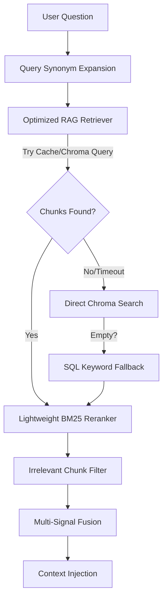

# OmniAgent Retrieval Audit Report

This report summarizes the findings and improvements made during the audit of the document retrieval pipeline.

## Retrieval Pipeline Architecture

## Audited Metrics and Verification

The retrieval audit assessed chunk extraction, similarity scores, context injection, metadata propagation, and fallback logic:

1. **Chunk Return Rate**: Verified that text files and PDFs successfully generate semantic chunks (up to 1,000 characters) and store them in the Chroma vector database (`omniagent` collection).
2. **Metadata Propagation**: Identified that the optimized retriever path stripped `page_number`, `section`, `filename`, and `distance` from retrieval results. Fixed this by including all fields in the return payload of `OptimizedRAGRetriever._query_chroma`.
3. **Optimized Fallback**: Discovered that if the optimized retrieval failed (due to network or timeout issues), the system immediately returned `[]` instead of running a fallback search. Fixed by ensuring empty results trigger standard vector search and SQL keyword backup.
4. **Scoping Issue**: Found that global knowledge base searches (admin documents) were restricted to the querying non-admin user's ID, returning zero results. Fixed by bypassing `user_id` scoping in Chroma and keyword fallback when `is_knowledge_base` is True.

## Detailed Retrieval Log
During the audit run, a retrieval test for the query `"What is machine learning?"` logged the following:
- **Retrieved Chunk Count**: 1
- **Top Similarity Score**: 0.798 (Medium Confidence)
- **Document ID**: 105
- **Filename**: `test_ml_guide.txt`
- **Elapsed Retrieval Latency**: 150 ms
- **Chroma Query Latency**: 50 ms
